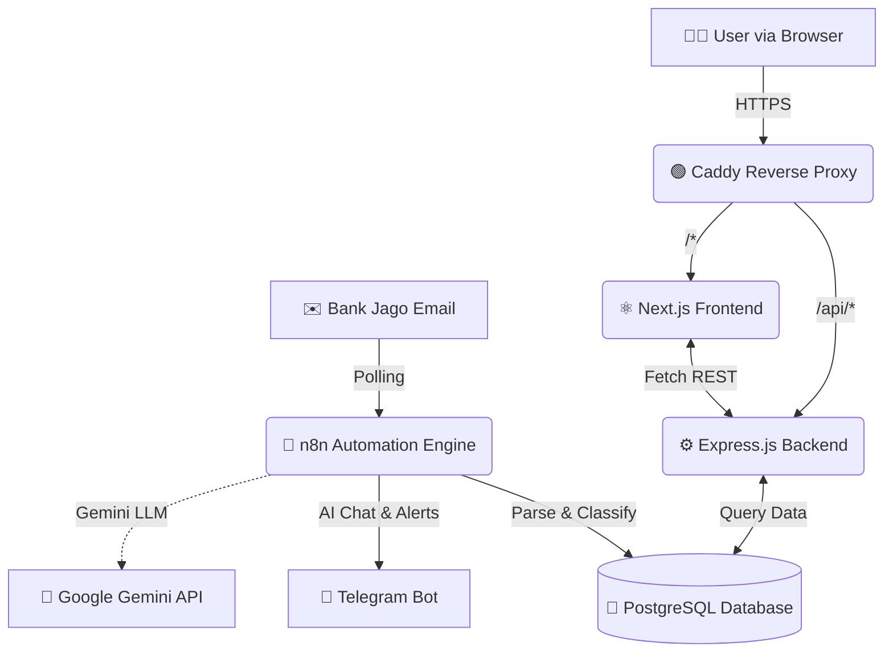

<div align="center">

# 💰 Bank Jago Expense Tracker (Full-Stack)

Sistem pencatatan keuangan pribadi otomatis berbasis **n8n**, **Next.js**, **Express.js**, dan **PostgreSQL**. Memantau transaksi Bank Jago secara real-time via email, menyajikannya dalam Dashboard interaktif, dan dilengkapi dengan AI Chatbot via Telegram.


</div>

---

## ✨ Fitur Utama

### 🖥️ Dashboard Interaktif (Frontend)
- **Ringkasan Keuangan**: Pantau saldo, total pengeluaran, dan pendapatan secara real-time.
- **Visualisasi Data**: Grafik pengeluaran bulanan dan distribusi kategori menggunakan analitik visual yang memukau.
- **Manajemen Transaksi**: Lihat riwayat lengkap, **tambah transaksi manual**, dan filter data berdasarkan bulan/tipe.
- **Indikator Kesehatan**: Peringatan otomatis (Safe/Warning/Danger) berdasarkan target tabungan (saving limit).

### 🤖 Otomatisasi & AI (n8n & Gemini)
- **Ekstraksi Email Otomatis**: Setiap notifikasi transaksi dari Bank Jago otomatis diproses 24/7.
- **Smart Categorization**: Klasifikasi cerdas antara pengeluaran (debit), pemasukan (kredit), dan transfer.
- **Telegram Alert**: Notifikasi langsung ke HP Anda setiap kali transaksi terjadi.
- **Chatbot AI**: Tanyakan kondisi keuangan Anda menggunakan bahasa manusia (contoh: *"Berapa sisa budget bulan ini?"*).

### ⚙️ REST API (Backend)
- Endpoint aman dan terstruktur untuk melayani data ke Dashboard.
- Mendukung operasi manipulasi data untuk sinkronisasi dengan n8n.

---

## 🏗️ Arsitektur Sistem

Aplikasi ini sekarang berjalan dengan arsitektur **microservices-lite** dan di-deploy secara terpusat menggunakan Docker Compose.



---

## 📁 Struktur Proyek (Monorepo)

```text
money-tracking/
├── frontend/             # Aplikasi UI berbasis Next.js (App Router), TailwindCSS, Recharts
├── backend/              # REST API berbasis Express.js & Node.js
├── n8n/                  # Konfigurasi workflow & credentials (JSON)
├── database/             # Skema SQL, trigger otomatis untuk rekap budget
├── terraform/            # (Legacy/Opsional) Infrastruktur sebagai Kode AWS
├── docker-compose.yml    # Orkestrasi container terpusat
└── Caddyfile             # Konfigurasi Reverse Proxy & Auto-HTTPS
```

---

## 🚀 Setup & Deployment Cepat (Docker)

Sistem ini didesain untuk mudah dijalankan pada VPS (seperti AWS EC2, DigitalOcean, dll) dengan hanya bermodalkan Docker.

### 1. Prerequisites
- Docker & Docker Compose terinstal di server.
- Domain publik (opsional, disarankan menggunakan DuckDNS).
- Akun Telegram (untuk Bot), Google Cloud (untuk Gmail API), dan Google AI Studio (untuk Gemini).

### 2. Konfigurasi Environment
Salin file environment dan isi nilainya sesuai server Anda:
*(Setiap sub-folder memiliki file `.env.example` sebagai rujukan)*

### 3. Build dan Jalankan Aplikasi
Dari root direktori, jalankan:
```bash
sudo docker compose up --build -d
```
Docker Compose akan membangun dan menyalakan 4 container sekaligus:
1. `backend` (Express.js API)
2. `frontend` (Next.js Dashboard)
3. `n8n` (Workflow Automation)
4. `caddy` (Web Server & Automatic SSL)

### 4. Setup Otomatisasi (Pertama Kali)
- Akses UI n8n di `https://n8n.domain-anda.com`.
- Impor file konfigurasi dari folder `/n8n`.
- Hubungkan OAuth2 Gmail, kredensial PostgreSQL, dan Token Bot Telegram.
- Aktifkan Workflow!

---

## 📚 Panduan API (Backend)
Backend menyediakan endpoint publik untuk dashboard:
- `GET /api/transactions` — Daftar riwayat transaksi (mendukung paginasi & filter).
- `POST /api/transactions` — Menambah riwayat transaksi secara manual (bukan dari Bank).
- `DELETE /api/transactions/:id` — Menghapus data transaksi (mengoreksi kesalahan).
- `GET /api/summary` — Statistik ringkasan dasbor & kalkulasi batas budget.

---

## 📝 Lisensi
Properti privat. Dikembangkan khusus untuk pencatatan keuangan pribadi Bank Jago.

---
**Dibuat dengan ❤️ oleh Andi Yusdar Al Imran**
